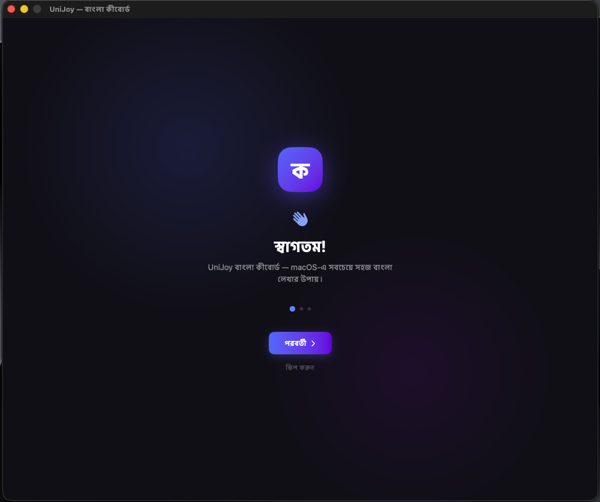
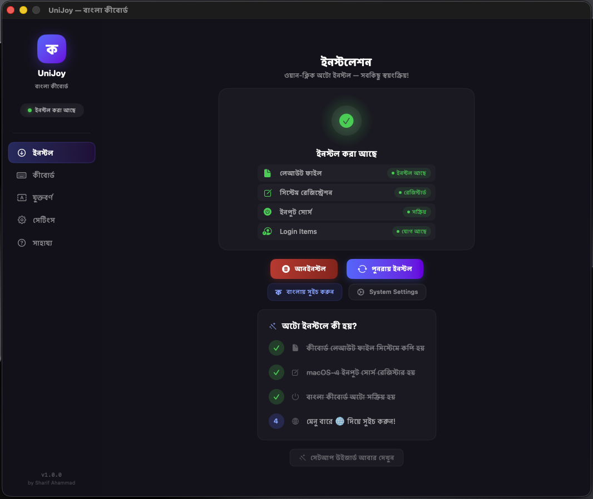

<div align="center">
  
  <h1>UniJoy-macOS 🇧🇩</h1>
  <p><strong>macOS-এর জন্য সবচেয়ে প্রফেশনাল ও সহজ বাংলা কীবোর্ড</strong></p>
  
  <p>
    <a href="https://github.com/nuxrif/UniJoy-macOS/releases/latest">
      
    </a>
    
    
  </p>
</div>

---

## 🌟 প্রোজেক্ট সম্পর্কে
**UniJoy-macOS** হলো ম্যাক ব্যবহারকারীদের জন্য একটি ডেডিকেটেড বাংলা কীবোর্ড অ্যাপ। এটি কোনো থার্ড-পার্টি ইঞ্জিন (যেমন অভ্র) ব্যবহার না করে সরাসরি **macOS Native Input Source** হিসেবে কাজ করে। এতে রয়েছে দারুণ একটি ডার্ক-মোড ইউজার ইন্টারফেস, বিল্ট-ইন টাইপিং টেস্ট এবং একটি বিশাল যুক্তবর্ণের কালেকশন।

## ✨ মূল ফিচারসমূহ
* ⚡ **ওয়ান-ক্লিক অটো ইনস্টল:** কোনো ম্যানুয়াল সেটআপের ঝামেলা নেই।
* 🎨 **নেটিভ ডার্ক মোড UI:** প্রফেশনাল এবং ম্যাকের সাথে পুরোপুরি মানানসই।
* ⌨️ **ইন্টারেক্টিভ কীবোর্ড ও টাইপিং টেস্ট:** অ্যাপের ভেতরেই বাংলা টাইপ করে প্র্যাকটিস করার সুবিধা।
* 🔍 **যুক্তবর্ণ চার্ট:** ক্যাটাগরি ও সার্চ সুবিধা সহ বিশাল যুক্তবর্ণের তালিকা।
* 🔒 **সম্পূর্ণ প্রাইভেসি:** ইন্টারনেট কানেকশন প্রয়োজন নেই, কোনো ইউজার ডেটা সংগ্রহ করে না।

---

## 📸 স্ক্রিনশট
*(এখানে অ্যাপের ছবিগুলো রাখার জন্য একটি `assets` ফোল্ডার তৈরি করে ছবিগুলো রাখুন)*
<p align="center">
  
  
</p>

---

## 📥 ইনস্টলেশন গাইড

সবচেয়ে সহজ উপায়ে ইনস্টল করতে **Releases** সেকশন থেকে লেটেস্ট ভার্সনটি ডাউনলোড করুন:

1. [**UniJoy-Installer.pkg**](https://github.com/nuxrif/UniJoy-macOS/releases/latest) ডাউনলোড করুন।
2. ফাইলটিতে ডাবল-ক্লিক করে ইনস্টল করুন।
3. **Launchpad** বা **Applications** ফোল্ডার থেকে **UniJoy** অ্যাপটি ওপেন করুন।
4. অ্যাপের ভেতরের **"ইনস্টল"** বাটনে ক্লিক করুন!

> 💡 **নোট:** কীবোর্ড লেআউট পরিবর্তন করতে মেনু বারের ডানদিকের কীবোর্ড আইকনে ক্লিক করুন অথবা `Control + Space` / `Globe (🌐)` বাটন চাপুন।

---

## 💻 ডেভেলপারদের জন্য (Build from Source)

আপনি চাইলে খুব সহজেই সোর্স কোড থেকে অ্যাপটি বিল্ড করতে পারেন।

```bash
# ১. রিপোজিটরি ক্লোন করুন
git clone https://github.com/nuxrif/UniJoy-macOS.git
cd UniJoy-macOS/UniJoyApp

# ২. অ্যাপ বিল্ড করুন (Xcode বা Command Line Tools লাগবে)
bash build.sh

# ৩. অ্যাপটি রান করুন
open build/UniJoy.app

# (ঐচ্ছিক) DMG বা PKG ইনস্টলার তৈরি করতে:
bash create_pkg.sh
bash create_dmg.sh
```

---

## 👨‍💻 ক্রেডিট ও কন্ট্রিবিউটর

* **macOS App Development:** [Sharif Ahammad](https://sharif.bd)
* **মূল লেআউট ডিজাইন:** S. M. Raiyan Kabir
* **রেফারেন্স:** [ekushey.org](https://ekushey.org)

---

## 📄 লাইসেন্স
এই প্রজেক্টটি [GNU LGPL v2.1](LICENSE) লাইসেন্সের অধীনে উন্মুক্ত। 

<div align="center">
  <p><strong>গর্বের সাথে বাংলায় টাইপ করুন! 🇧🇩</strong></p>
</div>
